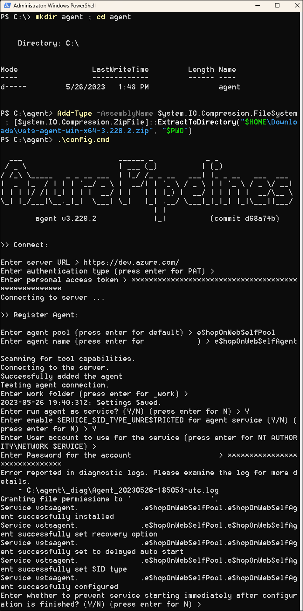
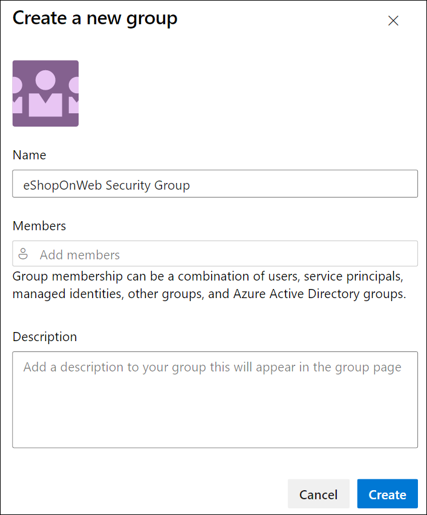

---
lab:
  title: 为安全管道配置代理和代理池
  module: 'Module 2: Configure secure access to pipeline resources'
---

# 为安全管道配置代理和代理池

在本实验室中，你将了解如何配置 Azure DevOps 代理和代理池，以及如何管理这些池的权限。 Azure DevOps 代理池提供用于运行生成和发布管道的资源。

这些练习大约需要 **25** 分钟来完成。

## 开始之前

需要 Azure 订阅、Azure DevOps 组织和 eShopOnWeb 应用程序才能遵循实验室。

- 按照步骤 [验证实验室环境](APL2001_M00_Validate_Lab_Environment.md)。

## 说明

你将使用 Windows 创建代理并配置自托管代理。 如果要在 Linux 或 MacOS 上配置代理，请按照 [Azure DevOps 文档](https://docs.microsoft.com/azure/devops/pipelines/agents/v2-linux)中的说明进行操作。

在配置期间，请记住以下事项：

- **为每个项目维护单独的代理**：每个代理只能绑定到一个池。 虽然跨项目共享代理池可以节省基础结构成本，但也会产生横向移动的风险。 因此，最好为每个项目提供单独的代理池和专用代理，以防止交叉污染。
- **利用低特权帐户运行代理**：在具有对 Azure DevOps 资源的直接访问权限的标识下运行代理可能会构成安全威胁。 建议在非特权本地帐户（如网络服务）下操作代理，从而最大程度地降低风险。
- **注意误导性组名称**：Azure DevOps 中的“项目集合服务帐户”组存在潜在的安全风险。 使用属于此组的标识运行代理，并由 Azure AD 提供支持，可能会危及整个 Azure DevOps 组织的安全性。
- **避免对自托管代理使用高特权帐户**：使用高特权帐户来运行自托管代理的话（特别是用于访问机密或生产环境时），如果管道遭到入侵，系统可能会面临严重威胁。
- **确定安全性的优先级**：为了保护系统，请使用最低特权帐户运行自托管代理。 例如，请考虑使用计算机帐户或托管服务标识。 建议允许 Azure Pipelines 处理对机密和环境的访问。

### 练习 1：创建代理并配置代理池

在本练习中，你将创建一个 Azure 虚拟机 (VM)，并使用它来创建代理和配置代理池。

#### 任务 1：创建并连接到 Azure VM

1. 在浏览器中，打开 `https://portal.azure.com` 处的 Azure 门户。 如果系统提示，请使用具有 Azure 订阅的“所有者”角色的帐户登录。

1. 在“**搜索资源、服务和文档(G+/)**”框中，键入“**虚拟机**”并从下拉列表中选择它。

1. 选择“创建”按钮。

1. 选择**具有预设配置的 Azure 虚拟机**。

    

1. 选择“**开发/测试**”作为工作负载环境，将“**常规用途**”作为工作负载类型。

1. 选择“**继续创建 VM**”按钮，在“**基本信息**”选项卡上执行以下操作，然后选择“**管理**”：

   | 设置 | 操作 |
   | -- | -- |
   | “订阅”下拉列表 | 选择 Azure 订阅。 |
   | “资源组”部分 | 创建名为 **rg-eshoponweb-agentpool** 的新资源组。 |
   | **虚拟机名称** 文本框 | 输入你偏好的名称，例如 **eshoponweb-vm**。 |
   | “区域”下拉列表 | 可以选择离你最近的 [azure](https://azure.microsoft.com/explore/global-infrastructure/geographies) 区域。 例如，“eastus”、“eastasia”、“westus”等。 |
   | **可用性选项**下拉列表 | 选择“无需基础结构冗余”。 |
   | **安全性类型**下拉列表 | 选择“**受信任启动虚拟机**”选项。 |
   | “映像”下拉列表 | 选择 **Windows Server 2022 Datacenter:Azure Edition - x64 Gen2** 映像。 |
   | **大小**下拉列表 | 为了测试，选择最便宜的**标准**大小。 |
   | **用户名**文本框 | 输入你偏好的用户名 |
   | **密码**文本框 | 输入你偏好的密码 |
   | **公共入站端口**部分 | 选择“允许所选端口”  。 |
   | **选择入站端口**下拉列表 | 选择“RDP (3389)”。 |

1. 在“**管理**”选项卡上的“**标识**”部分中，选中“**启用系统分配的托管标识**”复选框，然后选择“**查看 + 创建**”：

1. 在“查看 + 创建”选项卡上，选择“创建”。

   > **注意**：等待预配过程完成。 这大约需要 2 分钟。

1. 在 Azure 门户中，导航到显示新创建的 Azure VM 配置的页面。

1. 在 Azure VM 页上，选择“**连接**”，在下拉菜单中选择“**连接**”，然后选择“**下载 RDP 文件**”。

1. 使用下载的 RDP 文件与在 Azure VM 中运行的操作系统建立远程桌面会话。

#### 任务 2：创建代理池

1. 在与 Azure VM 的远程桌面会话中，启动 Microsoft Edge Web 浏览器。

1. 在 Web 浏览器中，导航到 `https://aex.dev.azure.com` 处的 Azure DevOps 门户，然后登录以访问你的组织。

   > **备注**：如果是第一次访问 Azure DevOps 门户，可能需要创建配置文件。

1. 打开 **eShopOnWeb** 项目，然后从左侧底部菜单中选择“**项目设置**”。

1. 在“**管道 > 代理池**”中，选择“**添加池**”按钮。

1. 选择“**自托管**”池类型。

1. 提供代理池的名称，例如 **eShopOnWebSelfPool**，并添加可选说明。

1. 不选中“**授予对所有管道的访问权限**”选项。

   

   > **备注**：不建议对生产环境中的所有管道授予访问权限。 它仅在此实验室中用于简化管道的配置。

1. 选择“**创建**”按钮以创建代理池。

#### 任务 3：下载并提取代理安装文件

1. 在 Azure DevOps 门户中，选择新建的代理池，然后选择“**代理**”选项卡。

1. 选择“**新建代理**”按钮，然后在新的弹出窗口中选择“**下载代理**”和“**下载**”按钮。

   > **备注**：按照安装说明安装代理并在文件名中记下下载的版本（例如：vsts-agent-win-x64-3.246.0.zip）

1. 启动 PowerShell 会话并运行以下命令创建名为 **agent** 的文件夹。

   ```powershell
   mkdir agent ; cd agent        
   ```

   > **备注**：请确保位于要安装代理的文件夹，例如 C:\agent。

1. 运行以下命令以提取下载的代理安装程序文件的内容：

   ```powershell
   Add-Type -AssemblyName System.IO.Compression.FileSystem ; [System.IO.Compression.ZipFile]::ExtractToDirectory("$HOME\Downloads\vsts-agent-win-x64-3.246.0.zip", "$PWD")
   ```

   > **备注**：如果将代理下载到其他位置（或下载的版本不同），请相应地调整上述命令。

#### 任务 4：创建 PAT 令牌

> **备注**：配置代理之前，需要创建 PAT 令牌（除非已有）。 若要创建 PAT 令牌，请执行以下步骤：

1. 在与 Azure VM 的远程桌面会话中，打开另一个浏览器窗口，导航到 Azure DevOps 门户（网址为 `https://aex.dev.azure.com`），然后访问你的组织和项目。

1. 从右侧顶部菜单中选择“**用户设置**”（就在你的用户头像图标左侧）。

1. 选择“**个人访问令牌**”菜单项。

   

1. 选择“**新建令牌**”按钮。

1. 提供令牌的名称，例如 **eShopOnWebToken**。

1. 选择要使用该令牌的 Azure DevOps 组织。

1. 设置令牌的到期日期（仅用于配置代理）。

1. 选择自定义的范围。

1. 选择以显示所有范围。

1. 选择“**代理池(读取和管理)**”范围。

1. 选择“**创建**”按钮以创建令牌。

1. 复制令牌值并将其保存在安全的位置（你将无法再次看到它）。 只能重新生成令牌）。

   

   > [!IMPORTANT]
   > 仅对代理配置使用最低特权选项“**代理池 (读取和管理)**”。 此外，如果这是令牌的唯一用途，请确保为令牌设置最短的到期日期。 如果需要再次配置代理，则可以创建另一个具有相同特权的令牌。

#### 任务 5：配置代理

1. 在与 Azure VM 的远程桌面会话中，切换回 PowerShell 窗口。 如有必要，请将当前目录更改为你在本练习前面将代理安装文件提取到的目录。

1. 若要将代理配置为无人参与运行，请调用以下命令：

   ```powershell
   .\config.cmd
   ```

   > **备注**：如果要以交互方式运行代理，请改用 `.\run.cmd`。

1. 若要配置代理，请在出现提示时执行以下操作：

   - 以“`https://aex.dev.azure.com`{你的组织名称}”格式输入 Azure DevOps 组织的 URL（**服务器 URL**）。
   - 接受默认身份验证类型 (**PAT**)。
   - 输入你在上一步中创建的 PAT 令牌的值。
   - 输入在本练习前面创建的代理池名称 **`eShopOnWebSelfPool`**。
   - 输入代理名称 **`eShopOnWebSelfAgent`**。
   - 接受默认代理工作文件夹 (_work)。
   - 输入 **Y** 将代理配置为作为服务运行。
   - 输入 **Y** 为代理服务启用 SERVICE_SID_TYPE_UNRESTRICTED。
   - 输入 **NT AUTHORITY\SYSTEM** 以设置服务的安全性上下文。

   > [!IMPORTANT]
   > 通常，配置服务安全性上下文时，应遵循最低特权原则。

   - 接受默认选项 (**N**)，以允许服务在配置完成后立即启动。

   

   > **备注**：完成代理配置过程可能需要几分钟时间。 完成后，会看到一条消息，指示代理正在作为服务运行。

   > [!IMPORTANT] 如果看到一条错误消息，指出代理未运行，则可能需要手动启动服务。 为此，请在 Windows 控制面板中打开“**服务**”小程序，找到名为 **Azure DevOps 代理 (eShopOnWebSelfAgent)** 的服务，然后启动它。

   > [!IMPORTANT] 如果代理无法启动，可能需要为代理工作目录选择其他文件夹。 为此，请重新运行代理配置脚本并选择其他文件夹。

1. 切换到显示 Azure DevOps 门户的 Web 浏览器，导航到代理池并单击“**代理**”选项卡，检查代理状态。此时应会在列表中看到新代理。

   

   > **备注**：有关 Windows 代理的更多详细信息，请参阅：[自托管 Windows 代理](https://learn.microsoft.com/azure/devops/pipelines/agents/windows-agent)

   > [!IMPORTANT]
   > 为了使代理能够从 Azure DevOps 管道生成和部署 Azure 资源（你将在接下来的实验室中逐步完成这部分），需要在托管代理的 Azure VM 的操作系统中安装 Azure CLI。

1. 启动 Web 浏览器并导航到[在 Windows 上安装 Azure CLI](https://learn.microsoft.com/cli/azure/install-azure-cli-windows?tabs=azure-cli#install-or-update) 页面。

1. 下载并安装 Azure CLI。

1. （可选）如果需要，请运行以下 PowerShell 命令以安装 Azure CLI：

   ```powershell
   $ProgressPreference = 'SilentlyContinue'; Invoke-WebRequest -Uri https://aka.ms/installazurecliwindows -OutFile .\AzureCLI.msi; Start-Process msiexec.exe -Wait -ArgumentList '/I AzureCLI.msi /quiet'; Remove-Item .\AzureCLI.msi
   ```

   > **备注**：如果使用不同版本的 Azure CLI，可能需要相应地调整上述命令。

1. 在 Web 浏览器中，导航到 `https://dotnet.microsoft.com/en-us/download/dotnet/thank-you/sdk-8.0.403-windows-x64-installer` 处的 Microsoft .NET 8.0 SDK 安装程序页面。

   > [!IMPORTANT]
   > 需要在托管代理的 Azure VM 上安装 .NET 8.0 SDK（或更高版本）。 这是在即将推出的实验室中生成 eShopOnWeb 应用程序所必需的。 应用程序生成所需的任何其他工具或 SDK 也应安装在 Azure VM 上。

1. 下载并安装 Microsoft .NET 8.0 SDK。

### 练习 2：创建和配置代理池安全性

在本练习中，你将为代理池配置安全性。

#### 任务 1：新建安全组

1. 在与 Azure VM 的远程桌面会话中，在显示 Azure DevOps 门户的 Web 浏览器中，在“**项目设置**”窗格的“**常规**”部分中，选择“**权限**”。

1. 选择“**新建组**”按钮。

1. 为组提供名称，例如 **eShopOnWeb 安全组**。

1. 选择“**创建**”按钮以创建组。

   

#### 任务 2：配置安全组

1. 在显示 Azure Devops 门户的 Web 浏览器窗口中，选择新组以显示其“**权限**”选项卡。

1. 拒绝对组不必要的权限，例如“**重命名团队项目**”、“**永久删除工作项**”或任何其他不希望组拥有的权限，因为我们假定仅将它用于代理池。

   

   > [!IMPORTANT]
   > 如果保留了不希望组拥有的权限，则代理上运行的脚本或任务可以使用组权限来执行你不希望它们执行的操作。

#### 任务 3：管理代理池权限

在此任务中，你将管理代理池的权限。

1. 在显示 Azure Devops 门户的 Web 浏览器窗口中，在“**eShopOnWeb**”项目的“**项目设置**”中，在“**管道**”部分中选择“**代理池**”。

1. 选择 **eShopOnWebSelfPool** 代理池。

1. 在代理池详细信息视图中，选择“**安全性**”选项卡。

1. 选择“**添加**”按钮，并将新组“**eShopOnWeb 安全组**”添加到代理池的用户权限。

1. 为用户或组选择适当的角色，例如代理池读者、用户或管理员。 在本例中，选择“**用户**”。

1. 选择“**添加**”以应用权限。

   

现在可以安全地在管道中使用代理池了。 可以使用新组来添加用户和管理代理池的权限。 可以使用新组重新配置已安装的自托管代理，以确保代理具有运行管道所需的权限，且不再有其他权限。 例如，可以将用户添加到组，并将代理配置为以该用户身份运行。

有关代理池的更多详细信息，请参阅：[代理池](https://learn.microsoft.com/azure/devops/pipelines/agents/pools-queues)。

> [!IMPORTANT]
> 请记住删除在 Azure 门户中创建的资源，以避免不必要的费用。

## 审阅

在本实验室中，你了解了如何配置 Azure DevOps 自托管代理和代理池，以及如何管理这些池的权限。 通过有效管理权限，可以确保适当的用户有权访问所需的资源，同时维护 DevOps 过程的安全性和完整性。
