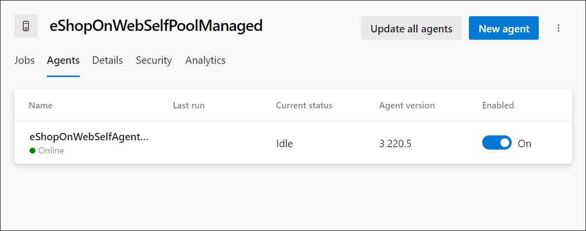

---
lab:
  title: 实验室 - 管理项目和管道的标识
  module: 'Module 2: Manage identity for projects, pipelines, and agents'
---

# 实验室 - 管理项目和管道的标识

托管标识提供了一种安全方法来控制对 Azure 资源的访问。 Azure 自动处理这些标识，使你能够验证对与 Azure AD 身份验证兼容的服务的访问。 这意味着无需将凭据嵌入代码中，从而增强了安全性。 在 Azure DevOps 中，托管标识可在自托管代理中对 Azure 资源进行身份验证，从而在不影响安全性的情况下简化访问控制。

在本实验室中，使用 Azure DevOps 及自托管代理和托管标识创建一个要在 YAML 管道中使用的托管标识。

此练习大约需要 30 分钟。

## 开始之前

需要 Azure 订阅、Azure DevOps 组织和 eShopOnWeb 应用程序才能遵循实验室。

- 按照步骤 [验证实验室环境](APL2001_M00_Validate_Lab_Environment.md)。

- 验证你是否拥有 Microsoft 帐户或具有 Azure 订阅中参与者或所有者角色的 Azure AD 帐户。 有关详细信息，请参阅[使用 Azure 门户列出 Azure 角色分配](https://learn.microsoft.com/azure/role-based-access-control/role-assignments-list-portal)和[在 Azure Active Directory 中查看和分配管理员角色](https://learn.microsoft.com/azure/active-directory/roles/manage-roles-portal)。

## 说明

### 练习 1：导入和运行 CI/CD 管道。

在本练习中，你将导入并运行 CI 管道，使用 Azure 订阅配置服务连接，然后导入并运行 CD 管道。

#### 任务 1：导入并运行 CI 管道

让我们首先导入名为 [eshoponweb-ci.yml](https://github.com/MicrosoftLearning/eShopOnWeb/blob/main/.ado/eshoponweb-ci.yml) 的 CI 管道。

1. 导航到 Azure DevOps 门户 `https://dev.azure.com` 并打开组织。

1. 打开 **eShopOnWeb** 项目。

1. 转到“管道”>“管道”。

1. 选择“ **新建管道** ”按钮。

1. 选择“Azure Repos Git (YAML)”。

1. 选择“eShopOnWeb”存储库。

1. 选择“现有 Azure Pipelines YAML 文件”。

1. 选择“/.ado/eshoponweb-ci.yml”文件，然后单击“继续”。

1. 单击“运行”按钮以运行管道。

    > [!NOTE]
    > 管道将采用基于项目名称的名称。 让我们重命名它，以便更好地识别管道。

1. 转到**管道>管道**，选择最近创建的管道，选择省略号，然后选择“重命名/移动 **”** 选项。

1. 将其命名为 eshoponweb-ci，然后单击“保存”。

#### 任务 2：管理服务连接

可以创建从 Azure Pipelines 到外部和远程服务的连接，以便在作业中执行任务。

在此任务中，你将使用 Azure CLI 创建服务主体，这将允许 Azure DevOps：

- 在 Azure 订阅上部署资源
- 部署 eShopOnWeb 应用程序

> [!NOTE]
> 如果已有一个服务主体和服务连接到名为 Azure 订阅的 **Azure 订阅**，则可以直接转到下一个任务。

你需要一个服务主体从 Azure Pipelines 部署 Azure 资源。

从管道定义内部连接到 Azure 订阅或从项目设置页面（自动选项）新建服务连接时，Azure Pipeline 会自动创建服务主体。 你也可以从门户或使用 Azure CLI 手动创建服务主体，然后在项目中重复使用。

1. 从实验室计算机启动 Web 浏览器，导航到 Azure 门户，并使用用户帐户登录，该帐户在本实验室中将使用的 Azure 订阅中具有所有者角色，并在与此订阅关联的 Azure AD 租户中具有全局管理员角色。

1. 在 Azure 门户中，单击页面顶部搜索文本框右侧的 Cloud Shell 图标。

1. 如果系统提示选择“Bash”或“PowerShell”，请选择“Bash”。

   > [!NOTE]
   > 注意：如果这是第一次启动 Cloud Shell，并看到“未装载任何存储”消息，请选择在本实验室中使用的订阅，然后选择“创建存储”  。

1. 在 Bash 提示符的 Cloud Shell 窗格中，运行以下命令以检索 Azure 订阅 ID 属性的值：

    ```sh
    subscriptionName=$(az account show --query name --output tsv)
    subscriptionId=$(az account show --query id --output tsv)
    echo $subscriptionName
    echo $subscriptionId
    ```

    > [!NOTE]
    > 注意：将两个值都复制到文本文件中。 稍后将在本实验室用到它们。

1. 在 Bash 提示符的 Cloud Shell 窗格中，运行以下命令以创建服务主体：

    ```sh
    az ad sp create-for-rbac --name sp-eshoponweb-azdo --role contributor --scopes /subscriptions/$subscriptionId
    ```

    > [!NOTE]
    > 注意：此命令将生成 JSON 输出。 将输出复制到文本文件中。 本实验室中稍后会用到它。

1. 从 Azure DevOps 门户导航到 EShopOnWeb 项目。 单击“项目设置 > 服务连接”（在“管道”下）和“新建服务连接”。

1. 在“新建服务连接”边栏选项卡上，选择“Azure 资源管理器”和“下一步”（可能需要向下滚动）。

1. 选择“**服务主体(手动)**”，然后选择“**下一步**”。

1. 使用在前面的步骤中收集的信息填写空字段：
    - 订阅 ID 和名称。
    - 服务主体 ID（或 clientId）、密钥（或密码）和 TenantId。
    - 在“服务连接名称”中，键入 azure subs。 需要 Azure DevOps 服务连接来与 Azure 订阅通信时，将在 YAML 管道中引用此名称。

1. 选择**验证并保存**。

#### 任务 3：导入并运行 CD 管道

让我们导入名为 [eshoponweb-cd-webapp-code.yml](https://github.com/MicrosoftLearning/eShopOnWeb/blob/main/.ado/eshoponweb-cd-webapp-code.yml) 的 CD 管道。

1. 转到“管道”>“管道”。

1. 单击“新建管道”按钮。

1. 选择“Azure Repos Git (YAML)”。

1. 选择“eShopOnWeb”存储库。

1. 选择“现有 Azure Pipelines YAML 文件”。

1. 选择“/.ado/eshoponweb-cd-webapp-code.yml”文件，然后单击“继续”。

1. 在 YAML 管道定义中，将变量部分设置为：

    ```YAML
    variables:
      resource-group: 'AZ400-EWebShop-NAME'
      location: 'westeurope'
      templateFile: '.azure/bicep/webapp.bicep'
      subscriptionid: 'YOUR-SUBSCRIPTION-ID'
      azureserviceconnection: 'azure subs'
      webappname: 'az400-webapp-NAME'
    ```

1. 将上述命令中的占位符替换为以下值。

   - **AZ400-EWebShop-NAME** ，其首选项名称， **例如 rg-eshoponweb**。
   - **位置** ，其中包含要部署资源的 Azure 区域的名称， **例如 southcentralus**。
   - YOUR-SUBSCRIPTION-ID，替换为你的 Azure 订阅 ID。
   - **az400-webapp-NAME**，具有要部署的 Web 应用名称具有全局唯一名称， **例如 eshoponweb-lab-YOURNAME**。

1. 如果存在，在 resources 节中删除以下条目：

    ```YAML
    repositories:
      - repository: eShopSecurity
        type: git
        name: eShopSecurity/eShopSecurity #name of the project and repository
    ```

1. 选择“保存”以直接提交到主分支，或者为此提交创建新分支。

1. 再次选择“保存并运行”  。

    > [!NOTE]
    > 如果选择创建新分支，则需要创建一个拉取请求以将更改合并到主分支。

1. 打开管道。 重要说明：如果看到消息“此管道需要访问资源的权限，然后才能继续运行 Docker Compose to ACI”，请再次单击“查看”、“允许”和“允许”。 这是允许管道创建资源所必需的。

    

1. 部署可能需要几分钟才能完成，等待管道执行。 CD 定义由以下任务构成：
      - 资源：它已准备好根据 CI 管道完成自动触发。 它还会下载 bicep 文件的存储库。
      - AzureResourceManagerTemplateDeployment：使用 bicep 模板部署 Azure Web 应用。

1. 管道将采用基于项目名称的名称。 让我们重命名它，以便更好地识别管道。

1. 转到**管道>管道**，选择最近创建的管道，选择省略号，然后选择“重命名/移动 **”** 选项。

1. 将其命名为 eshoponweb-cd-webapp-code，然后单击“保存”。

### 练习 2：为服务连接创建托管标识

在本练习中，你将创建托管标识，然后创建新的服务连接，以在 CI/CD 管道中使用它。

#### 创建并分配托管标识

1. 在浏览器中，打开 Azure 门户。

1. 在 **“搜索资源、服务和文档”（G+/）** 框中，键入 **托管标识** 并从下拉列表中选择它。

    

1. 选择之前创建的托管标识。

1. 在 **“创建托管标识** ”窗格中，填写所需的信息：
   - **使用 Azure 订阅进行订阅** 。
   - **资源组**：新的或现有的资源组。
   - **** 区域靠近你的位置或可用于资源的区域。
   - **** 具有首选项的托管标识名称的名称，例如 **eshoponweb-mi**。

    

    > [!NOTE]
    > 如果没有资源组，可以通过单击“ **创建新** ”链接创建一个。

1. 选择“查看 + 创建”****，然后选择“创建”****。

#### 为托管标识分配权限

接下来，需要将托管标识权限分配给资源组和应用服务。

1. 在 Azure 门户中，导航到创建的用户分配的托管标识。

1. 从 **“允许”菜单中选择“Azure 角色分配** ”选项卡。

1. **选择“添加角色分配**”按钮，并执行以下操作：

    | 设置 | 操作 |
    | -- | -- |
    | 打开下拉列表。 | 选择“资源组”****。 |
    | “订阅”下拉列表 | 选择 Azure 订阅。 |
    | “资源组”下拉列表 | 选择现有资源组 AZ801-L0601-RG |
    | 表的下拉列表 | 选择“参与者”角色。 |

1. 选择**保存**按钮。

    

### 练习 3：使用自承载代理和托管标识创建新的 Azure 虚拟机并更新 CI 管道

在本练习中，你将使用自承载代理和在上一练习中创建的托管标识创建新的 Azure 虚拟机。 然后，将更新 CI 管道以使用新的 Azure 虚拟机。

#### 任务 1：在 Azure 中创建 Windows 虚拟机

1. 在浏览器中，打开 Azure 门户。

1. 在**搜索资源、服务和文档（G+/）** 框中，键入**虚拟机**并从下拉列表中选择它。

1. 选择“创建”按钮。

1. 在“虚拟机”中，选择“+ 添加”>“+ 从预设的配置开始”****。

    

1. 选择 **“开发/测试**”作为工作负荷环境，将“常规用途 **”** 作为工作负荷类型。

1. 选择“ **继续创建 VM** ”按钮，在 **“基本信息** ”选项卡上执行以下操作，然后选择“ **管理** ”选项卡：

    | 设置 | 操作 |
    | -- | -- |
    | “订阅”下拉列表 | 选择 Azure 订阅。 |
    | “资源组”部分 | 选择现有或新的资源组， **例如 eshoponweb-resource**。 |
    | **虚拟机名称** 文本框 | 输入首选项的名称，例如 **eshoponweb-vm**。 |
    | “区域”下拉列表 | 选择靠近你的位置或可用于资源的区域，例如美国**** 中南部。 |
    | **可用性选项** 下拉列表 | 选择“无需基础结构冗余”。 |
    | **安全类型** 下拉列表 | 选择 **“受信任的启动虚拟机** ”选项。 |
    | “映像”下拉列表 | 对于“映像”，请选择“Windows Server 2019 Datacenter”。 |
    | “映像”下拉列表 | 为测试目的选择最便宜的 **标准** 大小。 |
    | “用户名”文本框 | 输入首选项的用户名 |
    | 密码文本框。 | 输入首选项的密码 |
    | **公共入站端口**：无。 | 选择“允许所选端口”  。 |
    | **选择入站端口** 下拉列表 | 选择“RDP (3389)”。 |

1. 在“Docker”选项卡上，执行以下操作，然后选择“查看 + 创建”：
   
    | **启用系统分配的托管标识**部分 |选择**检查框**。 这将允许 VM 使用创建的托管标识。 | |**公共 IP 地址**部分 |选择“新建 **”**，输入首选项的名称，然后选择“确定”**** |

    > [!IMPORTANT]
    > 请勿跳过步骤 5：删除 Azure 实验室资源以避免意外费用。

1. 在“查看 + 创建”选项卡上，选择“创建”。

1. 打开虚拟机设置，选择“ **标识** ”选项卡，然后选择 **“Azure 角色分配** ”按钮。

1. 选择“添加角色分配”按钮。

1. 选择订阅范围、订阅和 **参与者** 角色。

1. 选择**保存**按钮。

#### 任务 2：打开新的 Azure 虚拟机并安装自承载代理

1. 使用 RDP 连接打开之前创建的新 Azure 虚拟机。 可以在“概述 **”** 检查**连接**按钮中找到连接信息。

2. 在 Azure VM 中，按照步骤从实验室配置代理和代理池的练习 1 中安装代理，以用于安全管道[的新 Azure 虚拟机](APL2001_M03_L03_Configure_Agents_And_Agent_Pools_for_Secure_Pipelines.md)中。 按照说明进行操作时，请考虑以下更改：

   - 在任务 1 步骤 5 中将代理池 **eShopOnWebSelfPoolManaged** （而不是 **eShopOnWebSelfPool**）命名。
   - 将代理 **eShopOnWebSelfAgentManaged** （而不是 **eShopOnWebSelfAgent**）命名为任务 4 中的步骤 3。
   - 选择 **NT AUTHORITY\NETWORK 标准版RVICE** 作为帐户，在任务 4 的步骤 3 中的用户帐户配置期间运行服务。

3. 安装代理后，在 Azure DevOps 门户中打开代理池，并检查新代理可用。

    

### 练习 4：使用托管标识创建新的服务连接并更新 CD 管道

在本练习中，你将使用托管标识身份验证方法创建新的服务连接。 然后，将更新 CD 管道以使用新的服务连接。

#### 创建新的服务连接。

1. 导航到 Azure DevOps 门户 `https://dev.azure.com` 并打开组织。

1. 打开 **eShopOnWeb** 项目并导航到 **“项目设置”>服务连接**。

1. 单击“新建服务连接”按钮，然后选择“Azure 资源管理器”。

1. 在“身份验证方法”部分中，选择“托管标识”。

1. 使用在前面的步骤中收集的信息填写空字段：
    - 订阅 ID、名称和租户 ID（或 clientId）。
    - 在“服务连接名称”中，键入 azure subs。 需要 Azure DevOps 服务连接来与 Azure 订阅通信时，将在 YAML 管道中引用此名称。

1. 选择验证并保存。

#### 任务 2：更新 CD 管道

1. 导航到 Azure DevOps 门户 `https://dev.azure.com` 并打开组织。

1. 打开 **eShopOnWeb** 项目并导航到 **Pipelines > Pipelines**。

1. 选择 **eshoponweb-cd-webapp-code** 管道，然后选择“ **编辑**”。

1. 在“变量”部分中，使用在上一任务 **（azure 子管理**）中创建的服务连接的名称更新**服务连接ion** 变量。

    ```YAML
          azureserviceconnection: 'azure subs managed'
    ```

1. 在 **“阶段 **”部分的作业**子部分中，更新池**属性的值以引用在上一练习**中创建的**** 自承载代理池 eShopOnWebSelfPoolManaged**，因此其格式如下：

    ```YAML    
          jobs:
          - job: Deploy
            pool: eShopOnWebSelfPoolManaged
            steps:
            #download artifacts
            - download: eshoponweb-ci
    ```

1. 选择“保存”以直接提交到主分支，或者为此提交创建新分支。

1. 再次选择**保存**。

    > [!NOTE]
    > 如果选择创建新分支，则需要创建一个拉取请求以将更改合并到主分支。

1. 选择“ **运行** 管道”，然后单击“ **再次运行** ”。

1. 打开管道。 重要说明：如果看到消息“此管道需要访问资源的权限，然后才能继续运行 Docker Compose to ACI”，请再次单击“查看”、“允许”和“允许”。 这是允许管道创建资源所必需的。

1. 部署可能需要几分钟才能完成，等待管道执行。

1. 应从管道日志中看到管道正在使用托管标识。

    

管道完成后，可以转到Azure 门户并检查新的App 服务资源。

### 练习 5：删除 Azure 实验室资源

1. 在Azure 门户中，打开创建的资源组，并为本实验室中的所有已创建资源选择“**删除资源组**”。

    

    > [!WARNING]
    > 记得删除所有不再使用的新建 Azure 资源。 删除未使用的资源可确保不会出现意外费用。

## 审阅

在本实验室中，你学习了如何动态启用配置和管理功能标志。
