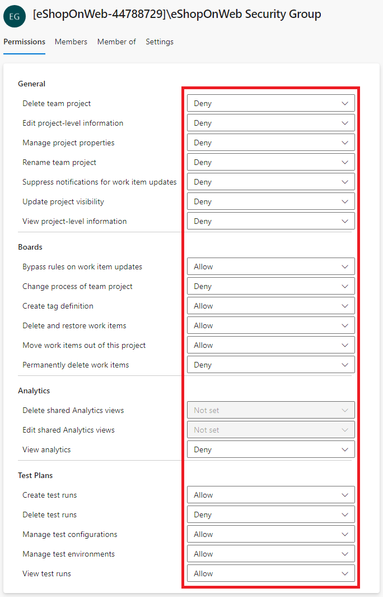

---
lab:
  title: 实验室 - 为安全管道配置代理和代理池
  module: 'Module 3: Configure secure access to pipeline resources'
---

# 实验室 - 为安全管道配置代理和代理池

在本实验室中，了解如何配置 Azure DevOps 代理和代理池，以及如何管理这些池的权限。 Azure DevOps 代理池提供用于运行生成和发布管道的资源。

此练习大约需要 30 分钟。

## 准备工作

需要 Azure 订阅、Azure DevOps 组织和 eShopOnWeb 应用程序才能遵循实验室。

- 按照步骤 [验证实验室环境](APL2001_M00_Validate_Lab_Environment.md)。
- 代理配置的 PAT 令牌。

## 说明

你将使用 Windows 创建代理并配置自承载代理。 如果要在 Linux 或 MacOS 上配置代理，请按照 Azure DevOps 文档中[的说明进行操作](https://docs.microsoft.com/azure/devops/pipelines/agents/v2-linux)。

在配置期间，请记住以下事项：

- **为每个项目**维护单独的代理：每个代理只能绑定到一个池。 虽然跨项目共享代理池可以节省基础结构成本，但也会产生横向移动的风险。 因此，最好为每个项目提供单独的代理池和专用代理，以防止交叉污染。
- **利用低特权帐户来运行代理：在具有直接访问 Azure DevOps 资源的标识下运行代理**可能会构成安全威胁。 建议在非特权本地帐户（如网络服务）下操作代理，从而最大程度地降低风险。
- **请注意误导性的组名称**：Azure DevOps 中的“项目收集服务帐户”组存在潜在的安全风险。 使用属于此组的标识运行代理，并由 Azure AD 提供支持，可能会危及整个 Azure DevOps 组织的安全性。
- **避免自承载代理的高特权帐户：使用高特权帐户运行自承载代理**，尤其是用于访问机密或生产环境，如果管道遭到入侵，系统可能会受到严重威胁。
- **确定安全性**的优先级：若要保护系统，请使用最低特权帐户运行自承载代理。 例如，使用计算机帐户或托管服务标识。 建议允许 Azure Pipelines 处理对机密和环境的访问。

### 练习 1：创建代理并配置代理池

在本练习中，你将创建代理并配置代理池。

#### 创建代理池

1. 导航到 Azure DevOps 门户 `https://dev.azure.com` 并打开组织。

1. **打开 eShopOnWeb** 项目，然后**从左侧底部菜单中选择“项目设置**”。

1. 在 **管道>代理池**中，选择“ **添加池** ”按钮。

1. **选择自承载**池类型。

1. 提供代理池的名称，例如 **eShopOnWebSelfPool**，并添加可选说明。

1. 选择“授予对所有管道的访问权限”。

    

1. 选择“创建”按钮以创建客户端。

#### 任务 2：创建代理

1. 选择新建的代理池，然后选择“ **代理** ”选项卡。

1. 选择 **“新建代理**”按钮，然后在**新的弹出窗口中从 **“下载代理**”按钮下载**按钮。

1. 按照安装说明从弹出窗口在计算机上安装代理。
   1. 从 Powershell 运行以下命令，在计算机中创建新的代理文件夹。

        ```powershell
        mkdir agent ; cd agent        
        ```

        > [!NOTE]
        > 请确保位于用户配置文件的根文件夹或要在其中安装代理的文件夹。

   2. 如果你从 Powershell 中选择 **计算机的“下载** ”文件夹，请运行建议的命令：

        ```powershell
        Add-Type -AssemblyName System.IO.Compression.FileSystem ; [SysteIO.Compression.ZipFile]::ExtractToDirecto("$HOME\Downloads\vsts-agent-win-x64-3.220.2.zip", "$PWD")
        
        ```
        > [!NOTE]
        > 如果将代理下载到其他位置，请替换上述命令中的路径。

#### 3.4.3.2 创建 PAT 令牌

在配置代理之前，请创建新的 PAT 令牌或选择现有令牌。 按照以下步骤创建新环境：

1. 导航到 Azure DevOps 门户 `https://dev.azure.com` 并打开组织。

1. 导航到 eShopOnWeb 项目，然后 **从右侧顶部菜单中选择“用户设置** ”（用户配置文件图片左侧）。

1. 在左侧菜单中选择“个人访问令牌”****。

    

1. 选择**新建**按钮。

1. 提供令牌的名称，例如 **eShopOnWebToken**。

1. 选择要使用该令牌的 Azure DevOps 组织。

1. 设置令牌的到期日期（仅用于配置代理）。

1. 选择自定义定义的作用域。

1. 选择“显示所有范围”。

1. 选择 **代理池（读取和管理）** 范围。

1. 选择“创建”按钮以创建应用。

1. 复制令牌值并将其保存在安全的位置（你将无法再次看到它）。 只能重新生成令牌。

    

    > [!IMPORTANT]
    > 仅对代理配置使用最后一个特权选项“ **代理池”（读取和管理**）。 此外，如果令牌是唯一的令牌用途，请确保为令牌设置最短的到期日期。 如果需要再次配置代理，则可以使用相同的权限创建新令牌。

#### 任务 4：配置代理

1. 打开一个新的 Powershell 窗口，并导航到在上一步中创建的代理文件夹。

1. 运行以下命令以开始配置代理。

    ```powershell
    .\config.cmd
    ```

    > [!NOTE]
    > （可选）通过运行 .\run.cmd 以交互方式运行代理。 不能在以交互方式运行时关闭命令提示符窗口。

1. 出现提示时，输入以下信息：
    - 输入 Azure DevOps 组织的 URL： `https://dev.azure.com/`{组织名称}。
    - 选择“身份验证类型: SAS URI”。
    - 输入在上一步中创建的 PAT 令牌值。
    - 输入在上一步中创建的代理池名称 **eShopOnWebSelfPool** 。
    - 输入代理名称 **eShopOnWebSelfAgent**。
    - 选择代理工作文件夹（默认为_work）。
    - 选择代理运行模式（Y 作为服务运行）。
    - 输入 Y 为代理服务（仅限 Windows）启用标准版RVICE_SID_TYPE_UNRESTRICTED。
    - 输入要用于服务的用户帐户。

        > [!IMPORTANT]
        > 若要运行代理服务，请不要使用高特权帐户。 请改用低特权帐户，该帐户保留服务操作所需的最低权限。 此方法有助于维护安全稳定的环境。

    - 输入是否阻止在配置完成后立即启动服务？

        

    - 导航到代理池并单击“ **代理** ”选项卡，检查代理状态。此时应会在列表中看到新代理。

        

有关 Windows 代理的更多详细信息，请参阅： [自承载 Windows 代理](https://learn.microsoft.com/azure/devops/pipelines/agents/windows-agent)

### 练习 2：为代理池创建和配置新的安全组

在本练习中，你将为代理池创建新的安全组。

#### 任务 3 - 创建网络安全组

1. 导航到 Azure DevOps 门户 `https://dev.azure.com` 并打开组织。

1. **打开 eShopOnWeb** 项目，然后**从左侧底部菜单中选择“项目设置**”。

1. “常规”下的“打开权限”。

1. 选择**新建**按钮。

1. 为组提供名称，例如 **eShopOnWeb 安全组**。

1. 添加要加入组的用户。

1. 选择“创建”按钮以创建应用。

    

#### 任务 4：配置网络安全组

1. 选择新组以显示其 **“权限** ”选项卡。

1. 拒绝组不必要的权限，例如 **重命名团队项目**、 **永久删除工作项**或任何其他不希望组拥有的权限，因为它仅用于代理池。

    

    > [!IMPORTANT]
    > 如果保留不希望组拥有的权限，则代理上运行的脚本或任务可以使用组权限来执行不希望他们执行的操作。

### 练习 - 管理权限

在本练习中，你将管理代理池的权限。

1. 导航到 Azure DevOps 门户 `https://dev.azure.com` 并打开组织。

1. **打开 eShopOnWeb** 项目，然后**从左侧底部菜单中选择“项目设置**”。

1. 选择“代理池”，然后选择“添加池”。

1. 选择 **eShopOnWebSelfPool** 代理池。

1. 在代理池详细信息视图中，选择“ **安全** ”选项卡。

1. **选择“添加**”按钮，并将新组 **eShopOnWeb 安全组**添加到代理池的用户权限。

1. 为用户或组选择适当的角色，例如代理池读取者、用户或管理员istrator。 在此例中选择 。

1. 选择“添加权限”按钮。

    

现在可以安全地在管道中使用代理池。 有关代理池的更多详细信息，请参阅： [代理池](https://learn.microsoft.com/azure/devops/pipelines/agents/pools-queues)。

### 练习 3：删除实验室中使用的资源

1. 通过运行 `.config.cmd remove`停止和删除代理服务。

1. 删除代理池。

1. 修改安全组

1. 撤销 PAT 令牌。

## 审阅

在本实验室中，了解如何配置 Azure DevOps 代理和代理池，以及如何管理这些池的权限。 通过有效管理权限，可以确保适当的用户有权访问所需的资源，同时维护 DevOps 流程的安全性和完整性。
