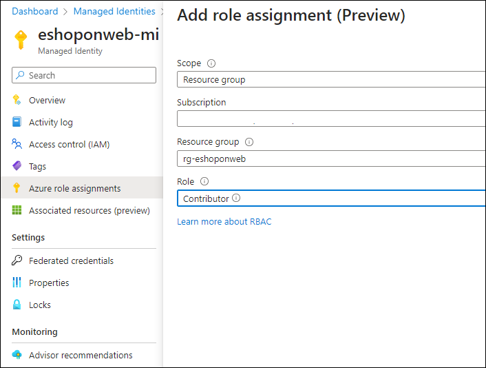

---
lab:
  title: 项目和管道的托管标识
  module: 'Module 3: Manage identity for projects, pipelines, and agents'
---

# 项目和管道的托管标识

托管标识提供了一种安全方法来控制对 Azure 资源的访问。 Azure 自动处理这些标识，使你能够验证对与 Azure AD 身份验证兼容的服务的访问。 这意味着你无需将凭据嵌入代码中，即可增强安全性。 在 Azure DevOps 中，托管标识可在自托管代理中对 Azure 资源进行身份验证，从而在不影响安全性的情况下简化访问控制。

在此实验室中，你将创建托管标识，并在自托管代理上的 Azure DevOps YAML 管道运行中使用它来部署 Azure 资源。

此实验室大约需要 **45** 分钟。

## 开始之前

需要 Azure 订阅、Azure DevOps 组织和 eShopOnWeb 应用程序才能遵循实验室。

- 按照步骤 [验证实验室环境](APL2001_M00_Validate_Lab_Environment.md)。
- 验证你是否拥有 Microsoft 帐户或 Microsoft Entra 帐户以及 Azure 订阅中的参与者或所有者角色。 有关详细信息，请参阅[使用 Azure 门户列出 Azure 角色分配](https://learn.microsoft.com/azure/role-based-access-control/role-assignments-list-portal)和[在 Azure Active Directory 中查看和分配管理员角色](https://learn.microsoft.com/azure/active-directory/roles/manage-roles-portal)。
- 完成“[为安全管道配置代理和代理池](APL2001_M03_L02_Configure_Agents_And_Agent_Pools_for_Secure_Pipelines.md)”这一实验室。

## 说明

### 练习 1：导入和运行 CI/CD 管道

在本练习中，你将导入并运行 CI 管道，使用 Azure 订阅配置服务连接，然后导入并运行 CD 管道。

#### 任务 1：导入并运行 CI 管道

让我们首先导入名为 [eshoponweb-ci.yml](https://github.com/MicrosoftLearning/eShopOnWeb/blob/main/.ado/eshoponweb-ci.yml) 的 CI 管道。

1. 导航到 Azure DevOps 门户 `https://dev.azure.com` 并打开你的组织。

1. 打开 eShopOnWeb**** 项目。

1. 转到 **“管道”>“管道”**。

1. 选择“创建管道”按钮****。

1. 选择“Azure Repos Git (YAML)”。

1. 选择“eShopOnWeb”存储库。

1. 选择“现有 Azure Pipelines YAML 文件”。

1. 选择“/.ado/eshoponweb-ci.yml”文件，然后单击“继续”。

1. 选择“**运行**”按钮以运行管道。

   > [!NOTE]
   > 管道将采用基于项目名称的名称。 为了更好地识别该管道，请为其重命名。

1. 转到“管道 > 管道****”，选择最近创建的管道，选择省略号，然后选择“重命名/移动****”选项。

1. 将其命名为 **eshoponweb-ci**，然后选择“**保存**”。

#### 任务 2：导入并运行 CD 管道

> [!NOTE]
> 在此任务中，你将导入并运行名为 [eshoponweb-cd-webapp-code.yml](https://github.com/MicrosoftLearning/eShopOnWeb/blob/main/.ado/eshoponweb-cd-webapp-code.yml) 的 CD 管道。

1. 在 eShopOnWeb**** 项目的“管道****”窗格中，选择“新建管道****”按钮。

1. 选择“Azure Repos Git (YAML)”。

1. 选择“eShopOnWeb”存储库。

1. 选择“现有 Azure Pipelines YAML 文件”。

1. 选择“**/.ado/eshoponweb-cd-webapp-code.yml**”文件，然后选择“**继续**”。

1. 在 YAML 管道定义中，将变量部分设为：

   ```yaml
   variables:
     resource-group: 'AZ400-EWebShop-NAME'
     location: 'southcentralus'
     templateFile: '.azure/bicep/webapp.bicep'
     subscriptionid: 'YOUR-SUBSCRIPTION-ID'
     azureserviceconnection: 'azure subs'
     webappname: 'az400-webapp-NAME'
   ```

1. 在变量部分，将占位符替换为以下值：

   - 将 **AZ400-EWebShop-NAME** 替换为你喜欢的名称，例如 **rg-eshoponweb**。
   - 将“location****”替换为要部署资源的 Azure 区域的名称，例如 **southcentralus**。
   - YOUR-SUBSCRIPTION-ID，替换为你的 Azure 订阅 ID。
   - 将 **az400-webapp-NAME** 替换为要部署的 Web 应用的全局唯一的名称，例如字符串 **eshoponweb-lab-id-**，后跟一个随机六位数字。 

1. 选择“**保存并运行**”，然后选择直接提交到主分支。

1. 再次选择“**保存并运行**”。

1. 打开管道。 如果看到消息“此管道需要访问资源的权限，然后此运行才能继续部署到 WebApp”，请选择“**查看**”和“**允许**”，然后再次选择“**允许**”。 这是允许管道创建 Azure 应用服务资源所必需的。

   

1. 部署可能需要几分钟才能完成，请等待管道执行。 CD 定义由以下任务构成：

   - **AzureResourceManagerTemplateDeployment**：使用 bicep 模板部署 Azure 应用服务 Web 应用。
   - **AzureRmWebAppDeployment**：将网站发布到 Azure 应用服务 Web 应用。

   > [!NOTE]
   > 如果部署失败，请导航到管道运行页，然后选择“**重新运行失败的作业**”以调用另一个管道运行。

   > [!NOTE]
   > 管道将采用基于项目名称的名称。 让我们重命名它，以便更好地识别管道。

1. 转到“管道 > 管道****”，选择最近创建的管道，选择省略号，然后选择“重命名/移动****”选项。

1. 将其命名为 **eshoponweb-cd-webapp-code**，然后选择“**保存**”。

### 练习 2：在 Azure 管道中配置托管标识

在本练习中，你将使用托管标识来配置新的服务连接并将其合并到 CI/CD 管道中。

#### 任务 1：配置自托管代理以使用托管标识并更新 CI 管道

1. 在浏览器中，打开 `https://portal.azure.com` 处的 Azure 门户。

1. 在 Azure 门户中，导航到显示你在此实验室中部署的 Azure VM **eshoponweb-vm** 的页面

1. 在 **eshoponweb-vm** Azure VM 页上的工具栏中，选择“**开始**”以启动它。

1. 在 **eshoponweb-vm** Azure VM 页上，在左侧的垂直菜单中，在“安全性****”部分中，选择“标识****”。

1. 在“eshoponweb-vm /|标识”**** 页上，验证“状态****”是否为“启用****”，并选择“Azure 角色分配****”。

1. 选择“添加角色分配****”按钮，然后执行以下操作：

   | 设置 | 操作 |
   | -- | -- |
   | “范围****”下拉列表 | 选择“订阅”。 |
   | “订阅”下拉列表 | 选择 Azure 订阅。 |
   | “角色****”下拉列表 | 选择“参与者”角色。 |

   > [!NOTE]
   > 订阅范围是适应后续实验室中的部署所必需的。

1. 选择**保存**按钮。

    

#### 任务 2：创建基于托管标识的服务连接

1. 切换到显示 Azure DevOps 门户 (`https://dev.azure.com`) 中 **eShopOnWeb** 项目的 Web 浏览器窗口。

1. 在 **eShopOnWeb** 项目中，导航到“项目设置 > 服务连接****”。

1. 选择“新建服务连接****”按钮，然后选择“Azure 资源管理器****”。

1. 选择“托管标识****”作为“身份验证方法****”。

1. 将范围级别设置为“订阅****”，并提供在验证实验室环境阶段收集的信息，包括订阅 ID、订阅名称和租户 ID。 

1. 在“服务连接名称****”中，输入“托管的 Azure 订阅****”。 访问 Azure 订阅时，将在 YAML 管道中引用此名称。

1. 选择“保存”。

#### 任务 3：更新 CD 管道

1. 切换到显示 Azure DevOps 门户中 **eShopOnWeb** 项目的浏览器窗口。

1. 在 **eShopOnWeb** 项目页上，导航到“管道 > 管道****”。

1. 选择 **eshoponweb-cd-webapp-code** 管道，然后选择“编辑****”。

1. 在变量部分中，更新 **serviceConnection** 变量，以使用在上一个任务中创建的服务连接的名称“托管的 Azure 订阅”****。

   ```yaml
     azureserviceconnection: 'azure subs managed'
   ```

1. 在“阶段****”部分的“作业****”子部分中，更新池**** 属性的值以引用在之前实验室中创建的自托管代理池 **eShopOnWebSelfPool**，因此其格式如下：

   ```yaml
     jobs:
     - job: Deploy
       pool: eShopOnWebSelfPool
       steps:
       #download artifacts
       - download: eshoponweb-ci
   ```

1. 选择“保存****”，然后选择直接提交到主分支。

1. 再次选择**保存**。

1. 选择“运行****”管道，然后再次单击“运行****”。

1. 打开管道。 如果看到消息“此管道需要访问资源的权限，然后此运行才能继续进入‘部署到 WebApp’阶段”，请选择“查看****”和“允许****”，然后再次选择“允许****”。 这是允许管道创建 Azure 应用服务资源所必需的。

1. 部署可能需要几分钟才能完成，请等待管道执行。

1. 你在管道日志中应该会看到管道正在使用托管标识。

   

   > [!NOTE]
   > 管道完成后，可以使用 Azure 门户来验证应用服务 Web 应用资源的状态。

### 练习 3：执行 Azure 和 Azure DevOps 资源的清理

在此练习中，你将对在此实验室中创建的一些 Azure 资源和 Azure DevOps 资源执行实验室后清理。

#### 任务 1：停止并解除分配 Azure VM

1. 导航到显示资源组 **rg-eshoponweb** 的页面，然后选择“删除资源组****”以删除其所有资源。

   > [!IMPORTANT]
   > 请勿删除包含自托管代理资源的资源组 **rg-eshoponweb-agentpool**。 你将在下一个实验室中用到它。

1. 在 Azure 门户中，导航到显示你在此实验室中部署的 Azure VM **eshoponweb-vm** 的页面

1. 在 **eshoponweb-vm** Azure VM 页上的工具栏中，选择“**停止**”以停止并解除分配它。

#### 任务 2：移除 Azure DevOps 管道

1. 导航到 Azure DevOps 门户 `https://dev.azure.com` 并打开你的组织。

1. 打开 eShopOnWeb**** 项目。

1. 转到 **“管道”>“管道”**。

1. 转到“**管道”>“管道**”并删除现有管道。

   > [!IMPORTANT]
   > 请勿删除在此实验室中创建的服务连接和代理池。 在下一部分中将用到它们。

#### 任务 3：重新创建 Azure DevOps 存储库

1. 在 Azure DevOps 门户中的 **eShopOnWeb** 项目中，选择左下角的“**项目设置**”。

1. 在左侧垂直菜单“**项目设置**”的“**Repos**”部分中，选择“**存储库**”。

1. 在“**所有存储库**”窗格中，将鼠标悬停在 **eShopOnWeb** 存储库条目的最右端，直到显示“**更多选项**”的省略号图标，选择它，然后在“**更多选项**”菜单中，选择“**重命名**”。  

1. 在“**重命名 eShopOnWeb 存储库**”窗口中的“**存储库名称**”文本框中，输入 **eShopOnWeb_old**，然后选择“**重命名**”。

1. 返回“**所有存储库**”窗格，选择“**+ 创建**”。

1. 在“**创建存储库**”窗格的“**存储库名称**”文本框中，输入 **eShopOnWeb**，取消选中“**添加自述文件**”复选框，然后选择“**创建**”。

1. 返回到“**所有存储库**”窗格，将鼠标悬停在 **eShopOnWeb_old** 存储库条目的最右端，直到显示“**更多选项**”的省略号图标，选择它，然后在“**更多选项**”菜单中，选择“**删除**”。  

1. 在“**删除 eShopOnWeb_old 存储库**”窗口中，输入 **eShopOnWeb_old** 并选择“**删除**”。

1. 在 Azure DevOps 门户的左侧导航菜单中，选择“**Repos**”。

1. 在 **eShopOnWeb 中为空。** 添加一些代码!” 窗格中，选择“**导入存储库**”。

1. 在“导入 Git 存储库”**** 窗口上，粘贴以下 URL `https://github.com/MicrosoftLearning/eShopOnWeb` 并选择“导入”****：

## 审阅

在本实验室中，你学习了如何使用分配给 Azure DevOps YAML 管道中的自托管代理的托管标识。