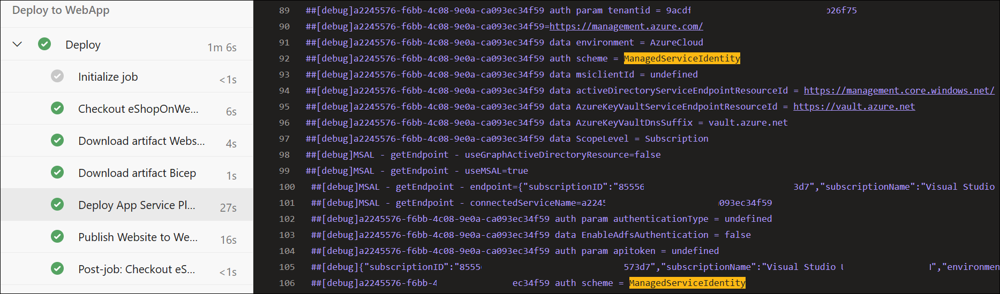

---
lab:
  title: 项目和管道的托管标识
  module: 'Module 3: Manage identity for projects, pipelines, and agents'
---

# 项目和管道的托管标识

托管标识提供了一种安全方法来控制对 Azure 资源的访问。 Azure 自动处理这些标识，使你能够验证对与 Azure AD 身份验证兼容的服务的访问。 这意味着你无需将凭据嵌入代码中，即可增强安全性。 在 Azure DevOps 中，托管标识可在自托管代理中对 Azure 资源进行身份验证，从而在不影响安全性的情况下简化访问控制。

在此实验室中，你将创建托管标识，并在自托管代理上的 Azure DevOps YAML 管道运行中使用它来部署 Azure 资源。

此实验室大约需要 **30** 分钟。

## 开始之前

需要 Azure 订阅、Azure DevOps 组织和 eShopOnWeb 应用程序才能遵循实验室。

- 验证你是否拥有 Microsoft 帐户或 Microsoft Entra 帐户以及 Azure 订阅中的参与者或所有者角色。 有关详细信息，请参阅[使用 Azure 门户列出 Azure 角色分配](https://learn.microsoft.com/azure/role-based-access-control/role-assignments-list-portal)和[在 Azure Active Directory 中查看和分配管理员角色](https://learn.microsoft.com/azure/active-directory/roles/manage-roles-portal)。

## 先决条件

完成实验室：

- 按照步骤 [验证实验室环境](APL2001_M00_Validate_Lab_Environment.md)。
- [配置项目和存储库结构以支持安全管道](APL2001_M01_L01_Configure_a_Project_and_Repository_Structure_to_Support_Secure_Pipelines.md)
- [为安全管道配置代理和代理池](APL2001_M02_L02_Configure_Agents_And_Agent_Pools_for_Secure_Pipelines.md)

## 说明

### 练习 0：（如果已完成，请跳过此任务）导入和运行 CI/CD 管道

在本练习中，你将在 Azure DevOps 项目中导入并运行 CI 管道。

#### 任务 1：（如果已完成，请跳过此任务）导入并运行 CI 管道

让我们首先导入名为 [eshoponweb-ci.yml](https://github.com/MicrosoftLearning/eShopOnWeb/blob/main/.ado/eshoponweb-ci.yml) 的 CI 管道。

1. 导航到 Azure DevOps 门户 `https://aex.dev.azure.com` 并打开你的组织。

1. 在 Azure DevOps 中打开 **eShopOnWeb** 项目。

1. 转到“**管道 > 管道**”。

1. 选择“**创建管道**”按钮。

1. 选择“Azure Repos Git (YAML)”。

1. 选择“eShopOnWeb”存储库。

1. 选择“现有 Azure Pipelines YAML 文件”。

1. 选择“/.ado/eshoponweb-ci.yml”文件，然后单击“继续”。

1. 选择“**运行**”按钮以运行管道。

   > **备注**：管道将采用基于项目名称的名称。 你将重命名它，以便更轻松地标识管道。

1. 转到“**管道”>“管道**”，然后选择最近创建的管道。 选择省略号，然后选择“**重命名/移动**”选项。

1. 将其命名为 **eshoponweb-ci**，然后选择“**保存**”。

#### 任务 2：（如果已完成，请跳过此任务）导入并运行 CD 管道

> **备注**：在此任务中，你将导入并运行名为 [eshoponweb-cd-webapp-code.yml](https://github.com/MicrosoftLearning/eShopOnWeb/blob/main/.ado/eshoponweb-cd-webapp-code.yml) 的 CD 管道。

1. 转到“**管道 > 管道**”。

1. 选择“**新建管道**”按钮。

1. 选择“Azure Repos Git (YAML)”。

1. 选择“eShopOnWeb”存储库。

1. 选择“现有 Azure Pipelines YAML 文件”。

1. 选择“**/.ado/eshoponweb-cd-webapp-code.yml**”文件，然后选择“**继续**”。

1. 在 YAML 管道定义中，将变量部分设为：

   ```yaml
   variables:
     resource-group: 'YOUR-RESOURCE-GROUP-NAME'
     location: 'centralus'
     templateFile: 'infra/webapp.bicep'
     subscriptionid: 'YOUR-SUBSCRIPTION-ID'
     azureserviceconnection: 'YOUR-AZURE-SERVICE-CONNECTION-NAME'
     webappname: 'YOUR-WEB-APP-NAME'
   ```

1. 将变量的值替换为环境的值：

   - 将 **YOUR-RESOURCE-GROUP-NAME** 替换为要在此实验室中使用的资源组名称，例如 **rg-eshoponweb-secure**。
   - 将**位置**变量的值设置为要部署资源的 Azure 区域的名称，例如 **centralus**。
   - 将 **YOUR-SUBSCRIPTION-ID** 替换为 Azure 订阅 ID。
   - 将 **YOUR-AZURE-SERVICE-CONNECTION-NAME** 替换为 **azure subs**
   - 将 **YOUR-WEB-APP-NAME** 替换为要部署的 Web 应用的全局唯一名称，例如，字符串 **eshoponweb-lab-multi-123456**，后跟一个随机的六位数。

1. 选择“**保存并运行**”，然后选择直接提交到主分支。

1. 再次选择“**保存并运行**”。

1. 打开管道运行。 如果看到消息“此管道需要访问资源的权限，然后才能继续运行‘部署到 WebApp’”，请选择“**查看**”、“**允许**”，然后再次选择“**允许**”。 这是允许管道创建 Azure 应用服务资源所必需的。

   

1. 部署可能需要几分钟才能完成，请等待管道执行。 管道会在 CI 管道完成后触发，其中包括以下任务：

   - **AzureResourceManagerTemplateDeployment**：使用 bicep 模板部署 Azure 应用服务 Web 应用。
   - **AzureRmWebAppDeployment**：将网站发布到 Azure 应用服务 Web 应用。

   > **备注**：如果部署失败，请导航到管道运行页，然后选择“**重新运行失败的作业**”，以调用另一个管道运行。

   > **备注**：管道将采用基于项目名称的名称。 让我们重命名它，以便更好地识别管道。

1. 转到“**管道”>“管道**”，然后选择最近创建的管道。 选择省略号，然后选择“**重命名/移动**”选项。

1. 将其命名为 eshoponweb-cd-webapp-code，然后单击“保存”。

### 练习 1：在 Azure 管道中配置托管标识

在本练习中，你将使用托管标识来配置新的服务连接并将其合并到 CI/CD 管道中。

#### 任务 1：在 Azure 订阅中设置托管标识

1. 在浏览器中，打开 `https://portal.azure.com` 处的 Azure 门户。

1. 在 Azure 门户中，导航到显示在[上一个实验室](APL2001_M02_L02_Configure_Agents_And_Agent_Pools_for_Secure_Pipelines.md)中部署的 Azure VM **eshoponweb-vm** 页。

1. 在 **eshoponweb-vm** Azure VM 页上的工具栏中，选择“**启动**”以启动它，以防它被停止。

1. 在 **eshoponweb-vm** Azure VM 页上，在左侧的垂直菜单中，在“安全性****”部分中，选择“标识****”。

1. 在“**标识**”页上，验证“**状态**”是否为“**启用**”，并选择“**Azure 角色分配**”。

1. 选择“添加角色分配****”按钮，然后执行以下操作：

   | 设置 | 操作 |
   | -- | -- |
   | “范围****”下拉列表 | 选择“订阅”。 |
   | “订阅”下拉列表 | 选择 Azure 订阅。 |
   | “角色****”下拉列表 | 选择“参与者”角色。 |

   > **备注**：订阅范围是适应后续实验室中的部署所必需的。

1. 选择**保存**按钮。

    

#### 任务 2：创建基于托管标识的服务连接

1. 切换到显示 Azure DevOps 门户 (`https://aex.dev.azure.com`) 中 **eShopOnWeb** 项目的 Web 浏览器窗口。

1. 在 **eShopOnWeb** 项目中，导航到“项目设置 > 服务连接****”。

1. 选择“新建服务连接****”按钮，然后选择“Azure 资源管理器****”。

1. 选择“托管标识****”作为“身份验证方法****”。

1. 将范围级别设置为**订阅**，并提供来自 Azure 门户的信息，包括**订阅 ID**、**订阅名称**和**租户 ID**。

   > **备注**：可以通过导航到“**订阅**”边栏选项卡并选择正在使用的订阅，在Azure 门户中找到**订阅 ID**。 可以在“**Microsoft Entra ID**”边栏选项卡中找到“**租户 ID**”。

1. 在“服务连接名称****”中，输入“托管的 Azure 订阅****”。 访问 Azure 订阅时，将在 YAML 管道中引用此名称。

1. 选择“保存”。

#### 任务 3：更新 CI 管道以使用自托管代理池

在此任务中，将更新 CI 管道以使用自托管代理池。

1. 切换到显示 Azure DevOps 门户中 **eShopOnWeb** 项目的浏览器窗口。

1. 在 **eShopOnWeb** 项目页上，导航到“**管道 > 管道**”。

1. 选择 **eshoponweb-ci** 管道，然后选择“**编辑**”。

1. 在“**阶段**”部分的“**作业**”子部分中，更新**池**属性的值以引用在此任务中配置的自托管代理池 **eShopOnWebSelfPool** ，因此其格式如下：

   ```yaml
     jobs:
     - job: Build
       pool: eShopOnWebSelfPool
       steps:
       - task: DotNetCoreCLI@2
   ```

1. 选择“**验证并保存**”，然后选择直接提交到主分支。

1. 再次选择**保存**。

1. 选择“**运行**”管道，然后再次单击“**运行**”。

1. 验证生成作业是否在 **eShopOnWebSelfAgent** 代理上运行并成功完成。

    > **备注**：如果看到消息“**代理请求未运行，因为所有潜在的代理都在运行其他请求。队列中的当前位置：1**”，可以等待代理可用，也可以停止正在运行的代理作业。 它可能是自动运行的 CD 管道。

    > **备注**：如果在管道运行页中看到消息“此管道需要访问资源的权限，然后此运行才能继续生成 .Net Core 解决方案”，请选择“**查看**”、“**允许**”，然后再次选择“**允许**”。 这是允许管道使用自托管代理池所必需的。

#### 任务 4：更新 CD 管道以使用自托管代理池和基于托管标识的服务连接

在此任务中，将更新 CD 管道以使用基于托管标识的服务连接和自托管代理池。

1. 切换到显示 Azure DevOps 门户中 **eShopSecurity** 项目的浏览器窗口。

   > **备注**：**eShopSecurity** 是在[第一个实验室](APL2001_M01_L01_Configure_a_Project_and_Repository_Structure_to_Support_Secure_Pipelines.md)中创建的项目的名称。

1. 在 **eShopSecurity** 项目页上，导航到“**Repos > 文件**”。

1. 选择**eshoponweb-secure-variables.yml**文件，然后单击“**编辑**”按钮。

1. 在变量部分中，更新 **azureserviceconnection** 变量，以使用在上一个任务中创建的服务连接的名称，**azure subs managed**。

   ```yaml
     azureserviceconnection: 'azure subs managed'
   ```

1. 单击“**提交**”按钮，然后选择直接提交到主分支。

1. 再次单击“**提交**”按钮。

1. 切换到 **eShopOnWeb** 项目。

1. 在 **eShopOnWeb** 项目页上，导航到“**管道 > 管道**”。

1. 选择 **eshoponweb-cd-webapp-code** 管道，然后选择“编辑****”。

1. 在“阶段****”部分的“作业****”子部分中，更新池**** 属性的值以引用在之前实验室中创建的自托管代理池 **eShopOnWebSelfPool**，因此其格式如下：

   ```yaml
     jobs:
     - job: Deploy
       pool: eShopOnWebSelfPool
       steps:
       #download artifacts
       - download: eshoponweb-ci
   ```

1. 单击“**验证并保存**”按钮，然后选择直接提交到主分支。

1. 再次单击“**保存**”。

1. 导航到“**管道 > 管道**”，并选择已从上一任务运行的 **eshoponweb-cd-webapp-code** 管道。

1. 单击管道运行并**取消**。 单击“**确定**”按钮进行确认。

   > **备注**：你将运行管道，启用系统诊断来查看管道的日志。

1. 单击以**运行新**管道，选中“启用系统诊断”复选框，然后单击“**运行**”按钮。

1. 打开管道运行。

   > **备注**：如果看到消息“此管道需要访问 2 个资源的权限，然后才能继续运行‘部署到 WebApp’”，请为所有资源选择“**查看**”、“**允许**”，然后再次选择“**允许**”。 这需要允许管道使用服务连接和自托管代理池。

1. 部署可能需要几分钟才能完成，请等待管道执行。

   > [!IMPORTANT]
   > 如果管道由于 AZ CLI 错误而失败，则可能需要重启自托管代理并重新运行管道。
   > 若要重启代理，请在 Azure 门户中导航到显示在上一实验室中部署的 Azure VM **eshoponweb-vm** 的页面，使用“**连接**”按钮连接到 VM，然后重启以 vstsagent 开头的 Azure Pipelines 代理服务名称。 右键单击代理服务，然后选择“**重启**”。

1. 你在管道日志中应该会看到管道正在使用托管标识。

   

   > **备注**：管道完成后，可以使用 Azure 门户来验证应用服务 Web 应用资源的状态。

   > [!IMPORTANT]
   > 请记住删除在 Azure 门户中创建的资源，以避免不必要的费用。

## 审阅

在本实验室中，你学习了如何使用分配给 Azure DevOps YAML 管道中的自托管代理的托管标识。
