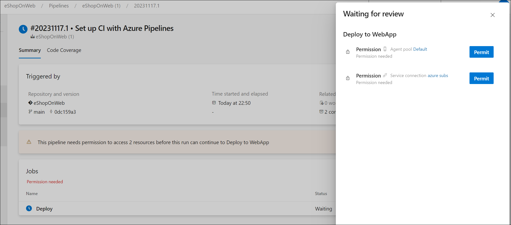

---
lab:
  title: 配置和验证权限
  module: 'Module 4: Configure and validate permissions'
---

# 配置和验证权限

在本实验室中，你将设置一个遵循最小权限原则的安全环境，确保成员只能访问执行任务所需的资源，将潜在的安全风险降到最低。 它涉及在 Azure DevOps 中配置和验证用户和管道权限以及设置审批和分支检查。

这些练习大约需要 **30** 分钟才能完成。

## 准备工作

需要 Azure 订阅、Azure DevOps 组织和 eShopOnWeb 应用程序才能遵循实验室。

- 按照步骤 [验证实验室环境](APL2001_M00_Validate_Lab_Environment.md)。
- 按照实验室“[为安全管道配置代理和代理池](/Instructions/Labs/APL2001_M02_L02_Configure_Agents_And_Agent_Pools_for_Secure_Pipelines.md)”或“[安装自托管代理](https://docs.microsoft.com/azure/devops/pipelines/agents/v2-windows?view=azure-devops#install)”中的步骤安装自托管代理。

## 说明

### 练习 1：导入 CI 管道并配置管道特定的权限

在本练习中，你将导入并运行 eShopOnWeb 应用程序的 CI 管道，并配置管道特定的权限。

#### 任务 1：导入并运行 CI 管道

> [!NOTE]
> 首先导入名为 [eshoponweb-ci.yml](https://github.com/MicrosoftLearning/eShopOnWeb/blob/main/.ado/eshoponweb-ci.yml) 的 CI 管道。

1. 导航到 Azure DevOps 门户 `https://dev.azure.com` 并打开你的组织。

1. 打开 eShopOnWeb**** 项目。

1. 转到 **“管道”>“管道”**。

1. 选择“新建管道”。

1. 选择“Azure Repos Git (YAML)”。

1. 选择“eShopOnWeb”存储库。

1. 选择“现有 Azure Pipelines YAML 文件”。

1. 选择“**/.ado/eshoponweb-ci.yml**”文件，然后选择“**继续**”。

1. 选择“**运行**”按钮以运行管道。

   > [!NOTE]
   > 管道将采用基于项目名称的名称。 为了更好地识别该管道，请为其重命名。

1. 转到“管道 > 管道****”，选择最近创建的管道，选择省略号，然后选择“重命名/移动****”选项。

1. 将其命名为 **eshoponweb-ci**，然后选择“**保存**”。

#### 任务 2：配置并运行具有特定权限的管道

> [!NOTE]
> 若要使用此任务中配置的代理池，首先需要启动托管代理的 Azure VM。 

1. 在浏览器中，打开 `https://portal.azure.com` 处的 Azure 门户。

1. 在 Azure 门户中，导航到显示你在此实验室中部署的 Azure VM **eshoponweb-vm** 的页面

1. 在 **eshoponweb-vm** Azure VM 页上的工具栏中，选择“**开始**”以启动它。

   > [!NOTE]
   > 接下来，将 CI 管道配置为使用相应的代理池运行，并验证运行管道的权限。 你需要具有编辑管道的权限，以及向代理池添加权限的权限。

1. 转到“项目设置”，然后选择“**管道**”下的“**代理池**”。

1. 打开 **eShopOnWebSelfPool** 代理池。

1. 选择“安全性”选项卡。

1. 在“**管道权限**”部分中，选择 **+** 按钮，然后选择“**eshoponweb-ci**”管道，以将其添加到有权访问代理池的管道列表中。

1. 导航到 **eShopOnWeb** 项目页面。

1. 在 **eShopOnWeb** 项目页上，导航到“**管道 > 管道**”。

1. 选择 **eshoponweb-ci** 管道，然后选择“**编辑**”。

1. 在“**阶段**”部分的“**作业**”子部分中，更新**池**属性的值以引用在此任务中配置的自托管代理池 **eShopOnWebSelfPool** ，因此其格式如下：

   ```yaml
     jobs:
     - job: Build
       pool: eShopOnWebSelfPool
       steps:
       - task: DotNetCoreCLI@2
   ```

1. 选择“**保存**”，然后选择直接提交到主分支。

1. 再次选择**保存**。

1. 选择“**运行**”管道，然后再次单击“**运行**”。

1. 验证生成作业是否在 **eShopOnWebSelfAgent** 代理上运行并成功完成。

#### 任务 3：配置 CD 管道并验证权限

1. 在 Azure DevOps 门户中的“**eShopOnWeb**”项目页上，转到“**管道 > 管道**”。

1. 选择“新建管道”。

1. 选择“Azure Repos Git (YAML)”。

1. 选择“eShopOnWeb”存储库。

1. 选择“现有 Azure Pipelines YAML 文件”。

1. 选择“**/.ado/eshoponweb-cd-webapp-code.yml**”文件，然后选择“**继续**”。

1. 在“变量”部分的 YAML 管道定义中，自定义：

   - **AZ400-EWebShop-NAME** 为喜欢的名称，例如 **rg-eshoponweb-perm**。
   - 要部署资源的 Azure 区域的名称的**位置**，例如 **southcentralus**。
   - YOUR-SUBSCRIPTION-ID，替换为你的 Azure 订阅 ID。
   - 使用 **azure 订阅托管**的 **azure 子订阅**
   - 具有要部署的 Web 应用的全局唯一名称的 **az400-webapp-NAME**，例如字符串 **eshoponweb-lab-perm-**，后跟一个随机六位数字。 

1. 更新 YAML 文件以使用 **eShopOnWebSelfPool** 代理池。 为此，请将**池**部分设置为以下值：

   ```yaml
     jobs:
     - job: Deploy
       pool: eShopOnWebSelfPool
       steps:
       #download artifacts
       - download: eshoponweb-ci
   ```

1. 选择“**保存并运行**”，然后再次选择“**保存并运行**”。

1. 打开管道，注意以下消息：“此管道需要访问 2 个资源的权限，然后此运行才能进入‘部署到 WebApp’”。 选择“**查看**”，然后选择“**允许**”以允许管道运行。

   

1. 将管道重命名为 **eshoponweb-cd-webapp-code**。

### 练习 2：配置和验证审批和分支检查

在本练习中，你将配置并验证 CD 管道的审批和分支检查。

#### 任务 1：创建环境并添加审批和检查

1. 在 Azure DevOps 门户中的“**eShopOnWeb**”项目页上，选择“**管道 > 环境**”。

1. 选择“创建环境”。

1. 将该环境命名为“**测试**”，选择“**无**”作为资源，然后选择“**创建**”。

1. 选择“**新建环境**”，创建新的环境“**生产**”，确保选择“**无**”作为资源，然后选择“**创建**”。

1. 打开“**测试**”环境，选择“**审批并检查**”选项卡。

1. 选择“审批”。

1. 在“**审批者**”文本框中，输入用户名。

1. 提供“**批准部署以进行测试**”说明，并选择“**创建**”。

   

1. 选择 **+** 按钮，选择“**分支控制**”，然后选择“**下一步**”。

1. 在“**允许的分支**”字段中，保留默认值并选择“**创建**”。 如果需要，可以添加更多分支。

   

1. 创建名为“**生产**”的另一个环境，并执行相同的步骤来添加审批和分支控制。 若要区分环境，请添加“**批准部署到生产**”说明，并将允许的分支设置为 **refs/heads/main**。

> [!NOTE]
> 你可以添加更多环境并为其配置审批和分支控制。 此外，你还可以配置“**安全性**”，以将用户或组添加到具有“*用户*”、“*创建者*”或“*读取者*”等角色的环境中。

#### 任务 2：将 CD 管道配置为使用新环境

1. 在 Azure DevOps 门户中的“**eShopOnWeb**”项目页上，选择“**管道 > 管道**”。

1. 打开管道 **eshoponweb-cd-webapp-code**。

1. 选择“编辑”  。

1. 将第 21-27 行（在 **#download 项目**注释的正上方）替换为以下内容：

   ```yaml
   stages:
   - stage: Test
     displayName: Testing WebApp
     jobs:
     - deployment: Test
       pool: eShopOnWebSelfPool
       environment: Test
       strategy:
         runOnce:
           deploy:
             steps:
             - script: echo Hello world! Testing environments!
   - stage: Deploy
     displayName: Deploy to WebApp
     jobs:
     - deployment: Deploy
       pool: eShopOnWebSelfPool
       environment: Production
       strategy:
         runOnce:
           deploy:
             steps:
             - checkout: self
   ```

   > [!NOTE]
   > 你需要将上文代码后面的所有行向右移到六个空格，以确保满足 YAML 缩进规则。

   管道应如下所示：

   

1. 选择“**保存**”（两次）和“**运行**”（两次）。

1. 打开管道的“**测试 WebApp**”阶段，并记下消息“**有 1 个审批需要你的批准，然后此运行才能进入测试 WebApp 阶段**。” 选择“**审批**”，然后选择“**批准**”。

   

1. 等待管道完成，打开管道日志，并检查是否已成功执行**测试 WebApp** 阶段。

   

1. 返回到管道，你将看到“**部署到 WebApp**”阶段在等待审批。 依次选择“**审批**”和“**批准**”，就像针对**测试 WebApp** 阶段所做的那样。

1. 等待管道完成，并检查是否已成功执行**部署到 WebApp** 阶段。

   

> [!NOTE]
> 你应该能够在测试和生产这两个环境中通过审批和分支检查，并成功运行管道。

### 练习 3：执行 Azure 和 Azure DevOps 资源的清理

在本练习中，你将移除在此实验室中创建的 Azure 和 Azure DevOps 资源。

#### 任务 1：删除 Azure 资源

1. 在 Azure 门户中，导航到包含已部署资源的资源组 **rg-eshoponweb-perm**，然后选择“**删除资源组**”以删除在此实验室中创建的所有资源。

#### 任务 2：移除 Azure DevOps 管道

1. 导航到 Azure DevOps 门户 `https://dev.azure.com` 并打开你的组织。

1. 打开 eShopOnWeb**** 项目。

1. 转到 **“管道”>“管道”**。

1. 转到“**管道 > 管道**”并删除现有管道。

#### 任务 3：重新创建 Azure DevOps 存储库

1. 在 Azure DevOps 门户中的 **eShopOnWeb** 项目中，选择左下角的“**项目设置**”。

1. 在左侧垂直菜单“**项目设置**”的“**Repos**”部分中，选择“**存储库**”。

1. 在“**所有存储库**”窗格中，将鼠标悬停在 **eShopOnWeb** 存储库条目的最右端，直到显示“**更多选项**”的省略号图标，选择它，然后在“**更多选项**”菜单中，选择“**重命名**”。  

1. 在“**重命名 eShopOnWeb 存储库**”窗口中的“**存储库名称**”文本框中，输入 **eShopOnWeb_old**，然后选择“**重命名**”。

1. 返回“**所有存储库**”窗格，选择“**+ 创建**”。

1. 在“**创建存储库**”窗格的“**存储库名称**”文本框中，输入 **eShopOnWeb**，取消选中“**添加自述文件**”复选框，然后选择“**创建**”。

1. 返回到“**所有存储库**”窗格，将鼠标悬停在 **eShopOnWeb_old** 存储库条目的最右端，直到显示“**更多选项**”的省略号图标，选择它，然后在“**更多选项**”菜单中，选择“**删除**”。  

1. 在“**删除 eShopOnWeb_old 存储库**”窗口中，输入 **eShopOnWeb_old** 并选择“**删除**”。

1. 在 Azure DevOps 门户的左侧导航菜单中，选择“**Repos**”。

1. 在 **eShopOnWeb 中为空。** 添加一些代码!” 窗格中，选择“**导入存储库**”。

1. 在“导入 Git 存储库”**** 窗口上，粘贴以下 URL `https://github.com/MicrosoftLearning/eShopOnWeb` 并选择“导入”****：

## 审阅

在本实验室中，你学习了如何设置一个遵循最小特权原则的安全环境，以确保成员只能访问执行任务所需的资源，将潜在的安全风险降到最低。 你在 Azure DevOps 中配置并验证了用户和管道权限，并设置了审批和分支检查。
