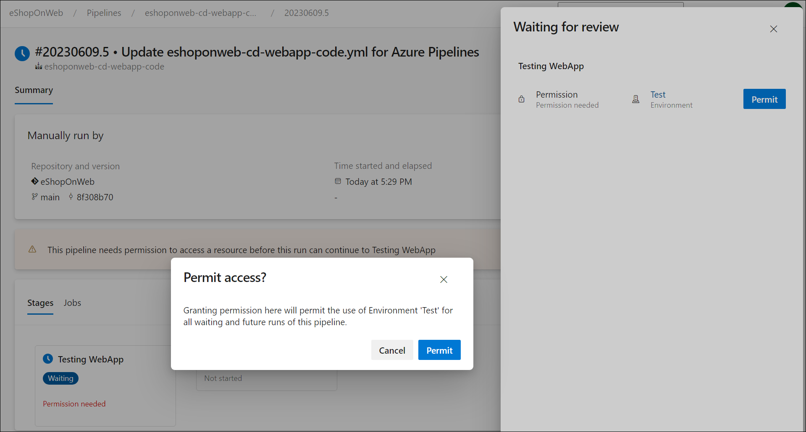

---
lab:
  title: 配置和验证权限
  module: 'Module 4: Configure and validate permissions'
---

# 配置和验证权限

在本实验室中，设置一个遵循最小特权原则的安全环境，确保成员只能访问执行任务所需的资源，将潜在的安全风险降到最低。 它涉及在 Azure DevOps 中配置和验证用户和管道权限以及设置审批和分支检查。

此练习大约需要 30 分钟。

## 准备工作

需要 Azure 订阅、Azure DevOps 组织和 eShopOnWeb 应用程序才能遵循实验室。

- 按照步骤 [验证实验室环境](APL2001_M00_Validate_Lab_Environment.md)。
- 按照实验室 [配置代理和代理池安装自承载代理，以便安全管道](/Instructions/Labs/APL2001_M03_L03_Configure_Agents_And_Agent_Pools_for_Secure_Pipelines.md) 或安装自承载代理中的 [步骤安装自承载代理](https://docs.microsoft.com/azure/devops/pipelines/agents/v2-windows?view=azure-devops#install)。

## 说明

### 练习 1：导入 CI 管道并配置管道特定权限

在本练习中，你将导入并运行 eShopOnWeb 应用程序的 CI 管道，并配置管道特定的权限。

#### 任务 1：导入并运行 CI 管道

> [!NOTE]
> 如果已在另一个实验室中完成，请跳过导入。

让我们首先导入名为 [eshoponweb-ci.yml](https://github.com/MicrosoftLearning/eShopOnWeb/blob/main/.ado/eshoponweb-ci.yml) 的 CI 管道。

1. 导航到 Azure DevOps 门户 `https://dev.azure.com` 并打开组织。

1. 打开 **eShopOnWeb** 项目。

1. 转到“管道”>“管道”。

1. 选择“ **新建管道** ”按钮。

1. 选择“Azure Repos Git (YAML)”。

1. 选择“eShopOnWeb”存储库。

1. 选择“现有 Azure Pipelines YAML 文件”。

1. 选择“/.ado/eshoponweb-ci.yml”文件，然后单击“继续”。

1. 单击“运行”按钮以运行管道。

1. 管道将采用基于项目名称的名称。 让我们重命名它，以便更好地识别管道。

1. 转到**管道>管道**，选择最近创建的管道，选择省略号，然后选择“重命名/移动 **”** 选项。

1. 将其命名为 eshoponweb-ci，然后单击“保存”。

### 任务 2：配置并运行具有特定权限的管道

在此任务中，将 CI 管道配置为使用特定代理池运行，并验证运行管道的权限。 需要具有编辑管道的权限，以及向代理池添加权限。

1. 转到“项目设置”，然后单击“管道”下的“代理池”。

1. **打开默认**代理池。

1. 选择“安全性”选项卡。

1. 如果代理池没有限制，请选择“ **限制权限** ”按钮。

    

1. 选择“ **添加** ”按钮并选择 **eshoponweb-ci** 管道，将其添加到有权访问代理池的管道列表中。

1. 选择“调试”以运行管道。

1. 打开正在进行的管道。 重要说明：如果看到消息“此管道需要访问资源的权限，然后才能继续运行 Docker Compose to ACI”，请再次单击“查看”、“允许”和“允许”。

应能够成功运行管道。

#### 任务 3：（如果已完成，请跳过） 配置 CD 管道并验证权限

> [!NOTE]
> 如果已在另一个实验室中完成，请跳过导入。

> [!IMPORTANT]
> 如果你有权限，你将能够 **允许** 管道直接从执行管道运行。 如果没有权限，则需要使用具有管理权限的另一个帐户，使管道能够使用上一任务 2 中所述的特定代理运行，或将用户权限添加到代理池。

1. 转到“管道”>“管道”。

1. 选择“ **新建管道** ”按钮。

1. 选择“Azure Repos Git (YAML)”。

1. 选择“eShopOnWeb”存储库。

1. 选择“现有 Azure Pipelines YAML 文件”。

1. 选择“/.ado/eshoponweb-cd-webapp-code.yml”文件，然后单击“继续”。

1. 在 YAML 管道定义中的变量部分中，自定义：
   - YOUR-SUBSCRIPTION-ID，替换为你的 Azure 订阅 ID。
   - **az400eshop-NAME**，具有要部署的 Web 应用名称具有全局唯一名称， **例如 eshoponweb-lab-YOURNAME**。
   - **AZ400-EWebShop-NAME** ，其首选项名称， **例如 rg-eshoponweb**。

1. 更新 YAML 文件，以使用**默认** Microsoft 托管代理池中的 **Windows 最新**映像。 若要执行此操作，请将 **池** 部分设置为以下值：

    ```yaml
    pool: 
      vmImage: windows-latest

    ```

1. 选择“保存”****，并选择“运行测试”****。

1. 打开管道，你将看到消息“此管道需要访问资源的权限，然后此运行才能继续部署 Web 应用”。 选择挂起的管道运行，然后选择“视图”。

    

### 配置和验证审批和分支检查

在本练习中，你将配置和验证 CD 管道的审批和分支检查。

#### 任务 1：创建新的环境并添加审批和检查

1. 转到 **管道>环境**。

1. 选择**创建环境**按钮。

1. 将环境**测试**命名为“无 **”** 作为资源，然后选择“**创建**”。

1. 选择“ **新建环境**”，创建新的环境 **“生产**”，选择“ **无”** 作为资源，然后选择“ **创建**”。

1. 打开**测试环境，选择...“******，然后选择**审批和检查****。

1. 选择“审批”。

1. 在 **“审批者** ”文本框中，输入用户名，如果有其他用户，请添加它以验证审批过程。

1. 提供说明 **，请批准部署以进行测试** 并选择“ **创建**”。

    

1. 选择 **+** 按钮，选择 **分支控件**，然后选择“ **下一步**”。

1. 在 **“允许的分支** ”字段中，保留默认值，然后选择“ **创建**”。 如果需要，可以添加更多操作。

    

1. 打开 **生产** 环境，并执行相同的步骤来添加审批和分支控制。 若要区分环境，请添加说明 **，请批准部署到生产**环境，并将 refs/heads/main** 分支添加到**允许的分支。

1. （可选）可以添加更多环境并为其配置审批和分支控制。 此外，还可以将 **安全性** 配置为将用户或组添加到环境。
    - 打开 **测试** 环境，选择 ***...“*** ，然后选择” **安全性**”。
    - 选择“**添加**”，然后选择运行管道的用户以及“用户 *”、“*创建者*”或 *“读者*”角色*。
    - 选择“添加”  。
    - 选择“保存”。

#### 任务 2：将 CD 管道配置为使用新环境

1. 转到“管道”>“管道”。

1. 打开 **eshoponweb-cd-webapp-code** 管道。

1. 选择“编辑”。

1. 在 **#download 项目** 注释上方，添加：

    ```yaml
    stages:
    - stage: Test
      displayName: Testing WebApp
      jobs:
      - deployment: Test
        pool:
          vmImage: 'windows-latest'
        environment: Test
        strategy:
          runOnce:
            deploy:
              steps:
              - script: echo Hello world! Testing environments!
    - stage: Deploy
    displayName: Deploy to WebApp
      jobs:
      - deployment: Deploy
        pool: 
          vmImage: windows-latest
        environment: Production
        strategy:
          runOnce:
            deploy:
              steps:
              - checkout: self
    ```

    > [!NOTE]
    > 需要将代码后面的行移到右侧的六个空格，以确保满足 YAML 缩进规则。

    管道应如下所示：

    

1. 选择“保存并运行”。

1. 打开管道，你将看到消息“此管道需要访问资源的权限，然后此运行才能继续测试 WebApp”。 再次选择“查看”、“允许”和 **“允许****”。 ******

    

1. **打开测试 WebApp** 阶段，你将看到消息 **1 审批需要你的评审，然后才能继续测试 WebApp**。 选择“ **审阅** ”，然后选择“ **批准**”。

    

1. 等待管道完成，打开管道日志并检查**测试 WebApp** 阶段已成功执行。

    

1. 返回到管道，你将看到“部署到 WebApp **”阶段**等待审批。 在测试 WebApp 阶段之前选择“**查看**和**批准**”。****

1. 等待管道完成 amd 检查**已成功执行“部署到 WebApp**”阶段。

    

应能够在环境、测试和生产环境中通过审批和分支检查成功运行管道。

### 练习 3：删除实验室中使用的资源

1. 在 Azure 门户中，打开创建的资源组，然后单击“删除资源组”。

    

    > [!WARNING]
    > 记得删除所有不再使用的新建 Azure 资源。 删除未使用的资源可确保不会出现意外费用。

1. 重置在此实验室中添加到 Azure DevOps 组织和项目的特定权限。

## 审阅

在本实验室中，设置一个遵循最小特权原则的安全环境，确保成员只能访问执行任务所需的资源，将潜在的安全风险降到最低。 它涉及在 Azure DevOps 中配置和验证用户和管道权限以及设置审批和分支检查。
